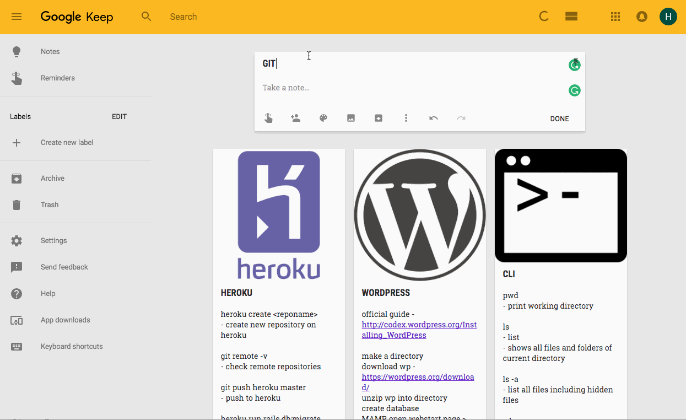

# Mini Cheat Sheets

johnahnz0rs is l33t
---

***

Have you ever found yourself searching the same commands on Google?  
Why not make a go to page every time you need to be reminded of a something? :)

## Intro
I was inspired to do this after someone showed me that this is possible. I wanted to make something similar to that and share it with beginners like me :heart:

## Usage

1. Fork this repo and then clone it.  
2. Go to https://keep.google.com  
3. In a new Google Keep note, copy and paste the text of one of the .txt files you've just downloaded.
3. If you want to add a picture at the top of the note, just drag the picture into the note. (I've included the pictures I used in the logos folder or you can use your own picture) 

## Contributing
Feel free to make pull requests to add, change/edit, and use this :octocat:

Never made a pull request?  
Don't worry, this repo will teach you how:
[first-contributions](https://github.com/Roshanjossey/first-contributions/blob/master/README.md)

Join [Hacktoberfest](https://hacktoberfest.digitalocean.com/) and make at least 4 pull requests to get a limited edition shirt and a virtual :cookie: !

Contributors:
hanapotski, 0x48piraj, AurelieBayre, chyku, ConnectExtend, xtine88, zsoltime, KirankumarAmbati